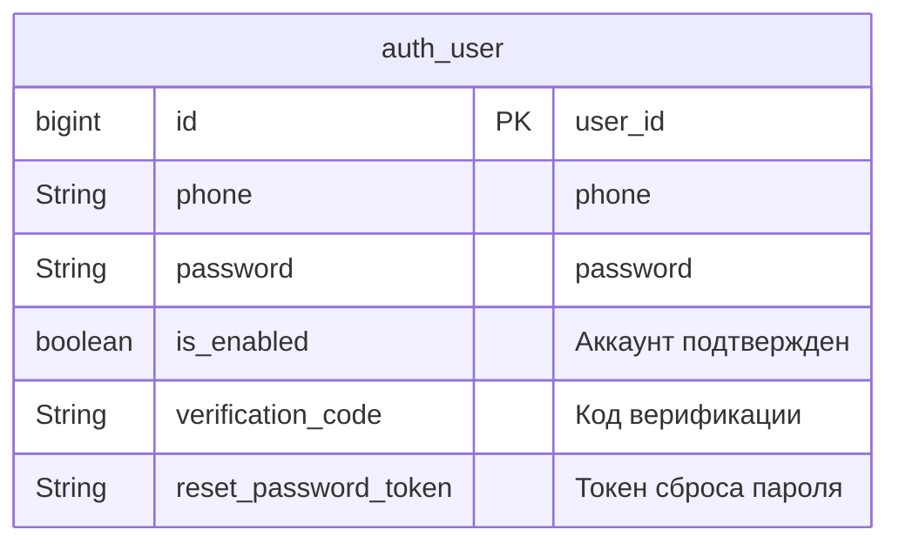

```mermaid
erDiagram
  auth_user{
    bigint id PK "user_id"
    String phone "phone"
    String password "password"
    boolean is_enabled "Аккаунт подтвержден"
    String verification_code "Код верификации"
    String reset_password_token "Токен сброса пароля"
  }
```
